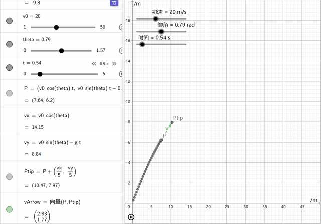
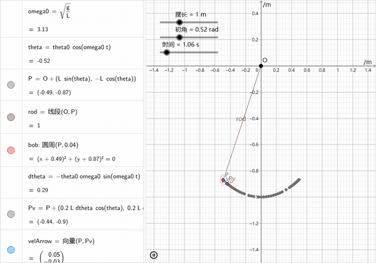
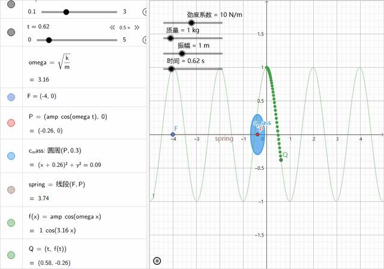
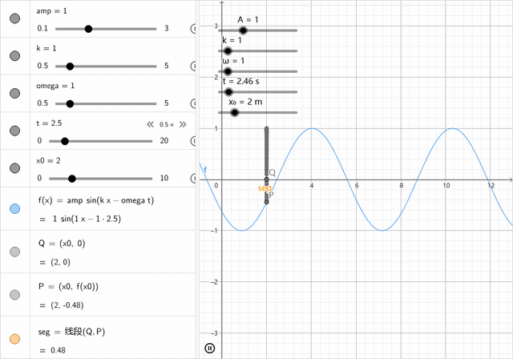
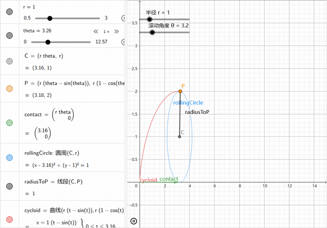
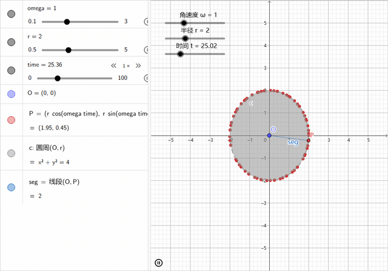

# AiGGB · AI 驱动的 GeoGebra 动态图像生成器

> 说人话 → 出动图。React 19 + Vite 8 + GeoGebra + 任意 OpenAI 兼容大模型，纯前端，可装 PWA。

---

## 演示

以下动图由 AiGGB 实际生成（真实 GeoGebra 渲染，非模拟）：

<div align="center">

| 物理 · 斜抛运动 | 物理 · 单摆 |
|---|---|
|  |  |

| 物理 · 弹簧振子 | 物理 · 横波传播 |
|---|---|
|  |  |

| 数学 · 摆线 | 数学 · 旋转变换 |
|---|---|
|  |  |

</div>

---

## 快速开始

```bash
npm install
npm run dev        # → http://localhost:5173
```

首次启动自动弹出 API 设置面板。推荐 **DeepSeek**（国内直连、速度快）：

| 设置项 | 值 |
|---|---|
| Provider | DeepSeek |
| 精炼模型 (Flash) | `deepseek-v4-flash` |
| API Key | `sk-...`（从 [platform.deepseek.com](https://platform.deepseek.com/api_keys) 获取） |
| 模型 | `deepseek-v4-pro`（复杂动图）或 `deepseek-v4-flash`（日常） |

点「测试连接」通过后保存，即可开始对话。

> ⚠️ Key 明文存浏览器 localStorage，**勿在公共电脑使用**。随时在设置中清除。

---

## 运行模式

AiGGB 提供两种执行模式，可在设置面板切换：

### 两阶段管线（默认）

```
用户输入 → Phase 1 精炼 (flash) → 规格确认气泡 → Phase 2 编译 (pro) → 执行 + 自修复
```

1. **Phase 1**：flash 模型将用户意图展开为详细分节绘图规格
2. **规格确认**：气泡展示规格，可编辑 / 重新生成 / 确认绘制
3. **Phase 2**：主力模型将精炼规格编译为 GGB 命令 JSON（含自检）

### Agent 模式（工具调用代理）

AI 逐步调用工具（创建点/滑块/矢量/执行命令/查询对象…），每步获得执行反馈后即时调整。适合复杂构造场景。

关键机制：
- **23 个工具**，分 safe / dangerous 两级（`eval_raw`/`delete`/`clear` 需用户确认，可信任会话后自动通过）
- **参数归一化**：Zod 校验 → 安全拦截 → **preFlight 语义预检**（负半径、min≥max、除零、依赖对象缺失在调用 GGB 前拦截，可读错误喂回 AI 自行修正）
- **未知工具过滤**：AI 臆造的工具名直接返回错误，不执行
- **连续失败熔断**：3 轮执行失败自动中止（参数类错误不计入，给模型自我修正机会）
- **思考实时展示**：V4 thinking 的 `reasoning_content` 增量经 `🧠` 气泡实时呈现，思考阶段不再干等
- **可重放**：工具调用 → `toolCallToEvalCommands` 映射为 GGB 命令，undo 回滚与训练回放复用同一套

---

## 如何写好提示词

> AiGGB 将你的自然语言转译为 GeoGebra 命令。描述越精确，结果越接近预期。下面是从入门到进阶的完整指南。

### 一、基础原则

**说清楚三个要素：画什么、参数怎么调、要不动起来。**

| ❌ 太模糊 | ✅ 明确 |
|---|---|
| 画个圆 | 画以原点为圆心、半径为 3 的圆 |
| 画个运动的点 | 点 P 在单位圆上匀速旋转，角速度用滑块控制 |
| 画个函数 | 画 y = sin(kx)，k 用滑块从 1 调到 5 |
| 画个三角锥 | 3D 正四面体边长 3，标注体积 |

> AiGGB 会对**确实缺少核心参数**的请求反问（如"画个圆"没给半径），但能合理默认的不会追问——圆心默认原点、角速度默认 slider=1。

### 二、让图像动起来

AiGGB 的核心价值是**动态可交互**。默认情况下 AI 会主动引入 slider 和动画，但你可以更精确地控制：

```
✅ "画出摆线，时间 t 自动播放，质点留轨迹"
✅ "斜抛运动 v0=20 m/s，仰角 45°，t 自动播放 increasing"
✅ "弹簧振子 k=10 N/m m=1 kg，下方同步画振动曲线"
```

**关键词**：`自动播放`、`留轨迹`、`滑块可调`、`动画`

### 三、指定参数与滑块

想控制某个量可调？直接说范围与默认值：

```
✅ "振幅 A 滑块 0.5~3 默认 1"
✅ "频率 k 滑块 0.5~5 默认 1"
✅ "质量 m 滑块 0.1~10 kg 默认 2"
✅ "阶数 n 滑块 1~12 默认 5，step=1 整数"
```

不给范围的参数 AI 会给合理默认值（如角速度默认 1 rad/s）。

### 四、物理场景

物理域有**专门优化**（矢量箭头、物理常量、受力分析）。建议切换到⚛物理模式后使用：

```
✅ "斜面 30° 上 2 kg 物块的受力分析，画重力、支持力、摩擦力"
✅ "斜抛 v0=20 仰角 45°，显示速度矢量和轨迹"
✅ "单摆 L=1 m 初角 30°，小角近似，留轨迹"
✅ "横波 y=A·sin(kx−ωt)，t 自动播放"
✅ "驻波：两列反向行波叠加，显示波节和波腹"
✅ "偶极子电场：+q 在 (d,0)，-q 在 (−d,0)，画矢量网格"
```

**物理模式自动启用**：`forceDiagram`（力矢量叠加）、`constants`（g=9.8 等物理常量）、`unitAxes`（坐标轴带单位 m/s）。

### 五、平面 / 3D 切换

AiGGB 默认在**二维平面**作图。工具栏提供手动切换按钮：

- **📐 平面模式**：默认。AI 只用 (x,y) 坐标，禁止 z 轴和三维修命令。即使用户说"正方体"，AI 也只在二维画俯视图或斜二测投影。
- **📦 3D 模式**：点击切换。画布重建为 3D 立体画布，AI 可使用 (x,y,z) 坐标和 Cube/Sphere/Cylinder/Tetrahedron 等 3D 专属命令。

> ⚠️ 切换模式会**清空当前画布和聊天历史**（2D 和 3D 是不同的 GGB 引擎）。

**3D 模式下：**

```
✅ "正方体边长 3，平面 ACF 截正方体，截面红色高亮"
✅ "正四面体边长 3，标注体积"
✅ "圆柱底面半径 2 高 5，展示侧面展开图"
✅ "球体半径 3，用平面 z=1.5 截球，截面橙色高亮"
✅ "空间向量 u=(2,0,0) 红色、v=(1,2,0) 绿色，叉乘 w=u×v 蓝色"
✅ "螺旋线 Curve(cos(t), sin(t), t/3) 橙色，红球 Sphere 表示粒子"
```

> 💡 如果你在平面模式描述 3D 内容，AI 会用二维投影表示。切换到 3D 模式后重新发送同一句话，即可得到真正的三维效果。

### 六、指定样式与配色

```
✅ "圆改成红色虚线，线宽加粗到 3"
✅ "轨迹用蓝色，矢量用绿色 #43a047"
✅ "几何体半透明蓝色 opacity 0.3"
✅ "背景网格隐藏" / "坐标轴标为 x/m 和 y/m"
```

### 七、多轮对话：修改与迭代

对话中 AI 会记住已创建的对象名，后续可以直接修改：

```
第 1 轮："画单位圆，点 P 在圆上旋转，留轨迹"
第 2 轮："把圆的颜色改成蓝色虚线"
第 3 轮："加一条从圆心 O 到 P 的半径，染绿"
第 4 轮："把 P 的轨迹关掉，速度改成 2 倍"
```

> ⚠️ 修改类指令（"改成红色""删除那个点"）需要 AI 在上下文中找到对象名。如果上一轮执行失败导致对象未创建，修改也会失败。

### 八、使用模板库

不想手写提示词？点击工具栏「模板」：

- **平面模式**：按当前 domain（数学/物理）各展示 4 个 2D 模板卡片（数学：正弦函数族、单位圆、圆锥曲线、摆线；物理：斜抛、圆周运动、单摆、偶极子电场）
- **3D 模式**：展示 4 个 3D 立体场景模板（正方体截面、正四面体、球体截面、螺旋运动）

点击卡片自动发送对应 prompt，由 AI 即时生成可拖动调节的动图。

### 九、常见误区

| ❌ 不要这样写 | ✅ 应该这样写 | 原因 |
|---|---|---|
| 画个图 | 画单位圆，点 P 绕圆周运动留轨迹 | 太模糊，AI 会反问 |
| 把速度改成 2 | 把 t 的动画速度改成 2 倍 | 引用明确对象名 |
| v = 5 m/s | 速度 magnitude 用 slider 默认 5 | `v` 在 GGB 中是 Vector 类型，不能做标量 |
| A = 3 | 振幅 A slider 默认 3 | 大写单字母 A 在 GGB 中默认 Point 类型（会与坐标点冲突） |
| 在 2D 画正方体 | 先切到 3D 模式，再画正方体 | 2D 模式 AI 只画投影 |

### 十、写出高质量提示词的检查清单

每次发送前，快速确认：

- [ ] 画什么？对象明确（圆/函数/点/矢量/几何体）
- [ ] 参数可调？slider 范围与默认值清楚
- [ ] 要不动？提到动画/轨迹/自动播放
- [ ] 颜色/样式？需要时直接指定
- [ ] 视窗范围？需要时给出 xmin/xmax/ymin/ymax
- [ ] 2D 还是 3D？工具栏模式正确

---

## 配置 AI Key

支持任意 OpenAI Chat Completions 兼容服务，预置 6 个 provider + 自定义：

| Provider | baseURL | 推荐模型 |
|---|---|---|
| **DeepSeek** | `https://api.deepseek.com` | `deepseek-v4-pro` / `v4-flash` |
| Moonshot (Kimi) | `https://api.moonshot.cn/v1` | `kimi-k2-0905-preview` |
| 智谱 GLM | `https://open.bigmodel.cn/api/paas/v4` | `glm-4.6` / `glm-4.6-flash` |
| SiliconFlow | `https://api.siliconflow.cn/v1` | `deepseek-ai/DeepSeek-V3` |
| OpenAI | `https://api.openai.com/v1` | `gpt-4o` / `gpt-4.1` |
| Ollama 本地 | `http://localhost:11434/v1` | `qwen2.5:7b` 等 |

> 日常推荐 `deepseek-v4-flash`（快、便宜）；复杂动图 + 3D 切 `deepseek-v4-pro`。Flash Model 用于 Phase 1 精炼和满足度评估（建议 v4-flash）。

> 💡 **思考深度（Thinking）**：设置面板高级区可调 V4 思考深度（跟随默认 / 低 / 中 / 高），对编译/评估/Agent 均发送 `reasoning_effort`。**默认关闭**——A/B 实测（N=10×6）显示 `high` 在 v4-flash 上端到端 −8.3%，无 token/延迟收益，不建议开启。Agent 模式仍会实时展示模型思考过程（`🧠` 气泡）。

---

## 工具栏

| 按钮 | 功能 |
|---|---|
| 📐 **数学** / ⚛ **物理** | 切换 System Prompt domain（影响 AI 的行为偏好） |
| 📐 **平面** / 📦 **3D** | 手动切换 2D/3D 画布（切换时清空当前会话） |
| 📚 模板 | 打开场景模板库（按当前 domain + 模式过滤） |
| 💬 会话 | 会话历史：多会话新建/切换/删除/重命名，随浏览器保存（含画布快照） |
| ↶ 撤销 | 撤销上一轮 AI 产生的全部命令 |
| 🗑 清空 | 清空画布与聊天历史，重置回平面模式 |
| 💾 导出 .ggb | 下载当前画布为 GeoGebra 文件 |
| 📷 截图 | 导出 PNG |
| 📋 复制脚本 | 把所有 eval 命令拼接复制到剪贴板 |
| ⚙ 设置 | 重新打开 API 配置面板 |

---

## 会话历史（浏览器本地保存）

每次对话自动保存为**会话**，刷新 / 重开页面后恢复，可随时回到任意历史场景继续编辑：

- **自动保存**：每轮 AI 构造完成后，消息 + 画布 base64 快照写入 IndexedDB（`aiggb` 库 v3），不阻塞 UI
- **恢复**：启动时自动装载上次会话（消息 + 画布）；画布快照优先恢复，失败回退重放构造命令
- **多会话管理**：工具栏「💬 会话」→ 新建 / 切换 / 删除 / 重命名
- **存储分离**：会话数据（`aiggb_sessions` 索引 + IndexedDB）与 API Key 配置（`aiggb_config`）完全隔离，不含任何凭据；「清除全部会话」可一键清空
- 容量上限 30 个会话，超出自动淘汰最旧

---

## 运行流程

### 两阶段管线

```
用户输入
  → Phase 1 精炼 (flash)：意图→详细分节绘图规格
  → 规格确认气泡（可编辑/重新生成/确认）
  → Phase 2 编译 (pro)：规格→GGB 命令 JSON（含自检）
  → RAG 命令纠正（Levenshtein 模糊匹配 + 臆造命令查表）
  → GGB 桥接逐条执行（op→evalCommand/setTrace/setColor…）
  → 满足度评估 (flash)：画布快照 vs 精炼规格逻辑审查
    → 满足 ✓ → 完成
    → 不满足 ✗ → 追加 issues → 1 次修复
  → 执行失败 ✗ → Checker 角色分析错误 → 重试（最多 2 次）
    → 全部失败 → 快照回滚 + 重放构造日志
```

### 六层防漂移

1. **提示层**：RAG 过滤的命令参考 + 臆造警告 + 五阶段流程 + Point/Vector 类型铁律
2. **自检层**：Phase 2 强制 AI 输出 `self_check` 逐项核对
3. **清洗层**：BOM 剥离 + Code Fence 清理
4. **校验层**：Zod discriminatedUnion 校验（硬黑名单 + XSS/注入拦截）
5. **纠正层**：RAG 命令后置纠正（Levenshtein ≤2 + 臆造映射 + 参数个数校验）
6. **执行层**：Pre-check（animate/trace 目标存在）+ Point+Point 自动重写 + Agent preFlight 语义预检（负半径/min≥max/除零/依赖缺失）+ 修复回路

---

## 分层记忆系统

Agent 模式运行时会沉淀可复用的经验，形成训练数据闭环（`trapStore.ts` / `trainingStore.ts` / `trajectoryStore.ts`，IndexedDB 持久化）：

- **prompt_hash**：prompt 版本指纹，标记记忆所对应的 System Prompt 版本
- **L2 场景**：按场景类型（单摆/电场/3D 几何…）分类的记忆索引
- **known_traps**：已确认的 GGB 陷阱（如 Circle 第二参点/半径混淆）——模型踩过并修复后沉淀为规则，下次提前规避
- **符号表**：画布对象名 + 类型快照，多轮修改直接引用
- **偏好**：配色 / 命名 / 视窗风格的用户偏好

每次 ReAct 轨迹（成功/失败）可回放（`npm run test:trajectory`），用当前执行层重放历史轨迹统计修复率，验证"越用越强"。

---

## PWA 安装

- **Chrome / Edge 桌面**：地址栏安装图标，或工具栏「安装」按钮
- **Android**：菜单 → 安装应用
- **iOS Safari**：分享 → 添加到主屏幕

安装后离线可打开界面和已缓存的 GGB SDK；AI 调用需在线。

---

## 技术栈

React 19 · Vite 8 · TypeScript 5 · Zustand 5 · Zod 3 · GeoGebra deployggb.js (5.4.927.1 local bundle) · react-markdown + KaTeX · vite-plugin-pwa (Workbox) · lucide-react

---

## 测试

| 命令 | 说明 |
|---|---|
| `npm run test:unit` | **103 单测（0 API）**：pipeline 状态机 / specCache / ggbBridge / ggbKB / toolExecutor / agentLoop / agentSmoke / satisfactionEval / trainingStore / trajectory-replay / trapStore |
| `npm run test:replay` | 离线回归 63 用例（当前 **63/63, 100%**） |
| `npm run test:trajectory` | 用当前执行层重放历史失败轨迹，统计"越用越强"修复率（离线） |
| `npm run test:record` | 在线全量 + 录制 fixtures（需 `.env` 配置 Key） |
| `npm run test:smoke` | 在线冒烟（static + clarify 子集） |
| `npm run test:drift` / `test:baseline` | 漂移监控 N=10 / 更新基线（需 `.env` Key）；`DRIFT_THINKING=high` 可单开 thinking 跑 |
| `npm run test:ab` | **A/B 对比**：thinking 开/关 同用例对比（端到端 + 延迟 + token 成本），输出 `tests/ab-report.json` |
| `npm run test:hash` | 查看 prompt 指纹 |
| `npm run prompt:iterate` / `analyze` / `golden` / `compare` | Prompt 迭代工作流 |
| `npm run test:visual` / `test:visual-all` | Playwright 截图回归 |
| `npm run test:e2e` | 欧几里得 E2E（需真实 Key） |

详见 [SPEC.md](SPEC.md) 第 10B/10C 章。

---

## 项目结构

```
src/
├── main.tsx / App.tsx         入口 + 顶层布局
├── components/
│   ├── ChatPanel.tsx           对话面板（输入/消息渲染/store 依赖注入）
│   ├── GGBCanvas.tsx           GeoGebra applet 嵌入（2D/3D 切换 + ResizeObserver 跟随 + 心跳自愈）
│   ├── Toolbar.tsx             工具栏（domain 切换/2D-3D/清空/撤销/导出）
│   ├── TemplateGallery.tsx     模板库（按 domain + 模式双重过滤）
│   ├── ScriptPanel.tsx         实时脚本展示
│   ├── SettingsDialog.tsx      API 配置
│   ├── SessionDialog.tsx       会话历史弹层（列表/新建/切换/删除/重命名）
│   └── MessageBubble.tsx / PWAUpdatePrompt.tsx
├── lib/
│   ├── pipeline.ts             两阶段管线状态机（Phase 1→确认→Phase 2→修复→评估）
│   ├── agentLoop.ts            Agent 模式 ReAct 循环（工具调用 + 熔断 + 未知工具过滤）
│   ├── toolExecutor.ts         Agent 工具执行（Zod 校验 + 安全拦截 + preFlight 语义预检 + 可重放映射）
│   ├── tools.ts                Agent 工具定义（Function Calling schema + 安全分级）
│   ├── aiClient.ts             OpenAI 兼容客户端（chat/chatRaw/agentChat 流式工具调用 + 3-role 模型）
│   ├── ggbBridge.ts            op→GGB API 执行器 + 画布快照 + 批量渲染
│   ├── schema.ts               Zod 校验 + CoordExpr 注入防护
│   ├── prompts.ts              System/Compile/Checker Prompt（few-shot 示例驱动）
│   ├── refinePrompt.ts         Phase 1 精炼 Prompt
│   ├── satisfactionEval.ts     满足度评估（flash 模型画布审查）
│   ├── commandCorrect.ts       RAG 命令后置纠正
│   ├── ggbKB.ts                命令知识库（~170 条 + 臆造映射 + 重载签名表）
│   ├── commands.ts             GGB 命令白名单/黑名单
│   ├── runControl.ts           单轮运行生命周期管理（AbortSignal/取消）
│   ├── specCache.ts            意图→规格缓存（模板精确匹配 + LRU）
│   ├── specSchema.ts           Phase 1 输出校验
│   ├── physics.ts              物理常量
│   ├── templates.ts            12 条模板（物理 4 + 数学 4 + 3D 4）
│   ├── providers.ts            AI 预置 provider
│   ├── trainingStore.ts        训练数据闭环（IndexedDB 轨迹持久化）
│   ├── trajectoryStore.ts      ReAct 轨迹构造（供回放/训练）
│   ├── sessionStore.ts         会话历史存储（IndexedDB + localStorage 索引分离）
│   └── trapStore.ts            分层记忆系统（prompt_hash / L2场景 / known_traps / 符号表 / 偏好）
├── store/useAppStore.ts        Zustand (persist v3)
├── styles/                     CSS Variables + 全局样式
└── types/ggb.d.ts              GGBAppletApi 类型

tests/
├── runner.ts + cases.json      63 用例离线回放运行器
├── mockGGB.ts                  轻量 GeoGebra Mock（类型推断 + 依赖检查 + 重载校验）
├── toolExecutor.test.ts        工具层 23 用例
├── agentLoop.test.ts           Agent 状态机 13 用例
├── agentSmoke.test.ts          Agent 端到端冒烟 4 场景（单摆/电场/3D/负例）
├── pipeline.test.ts / specCache.test.ts / ggbBridge.test.ts / ggbKB.test.ts / satisfactionEval.test.ts
├── trainingStore.test.ts / trajectory-replay.test.ts / trapStore.test.ts / sessionStore.test.ts
└── fixtures/                   录制的 AI 响应基线
```

---

## License

MIT
