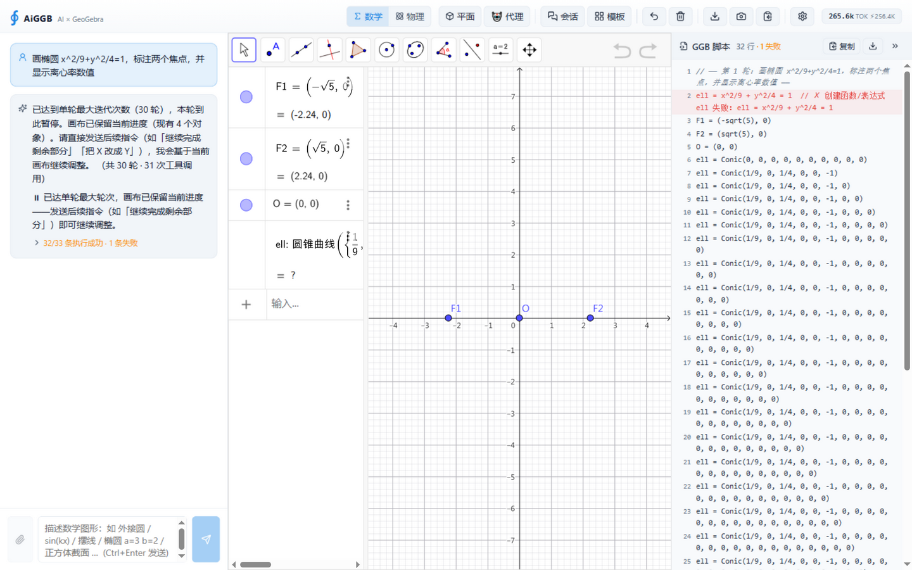
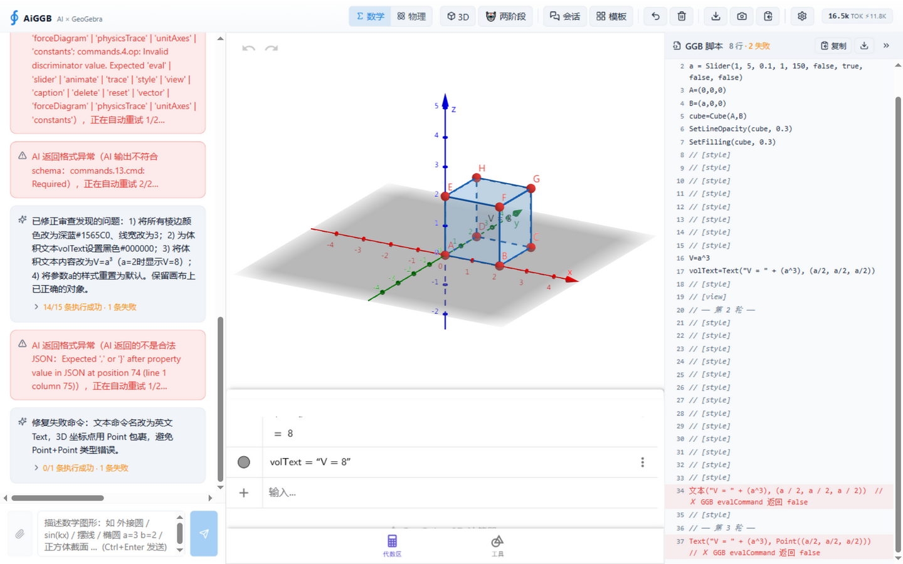
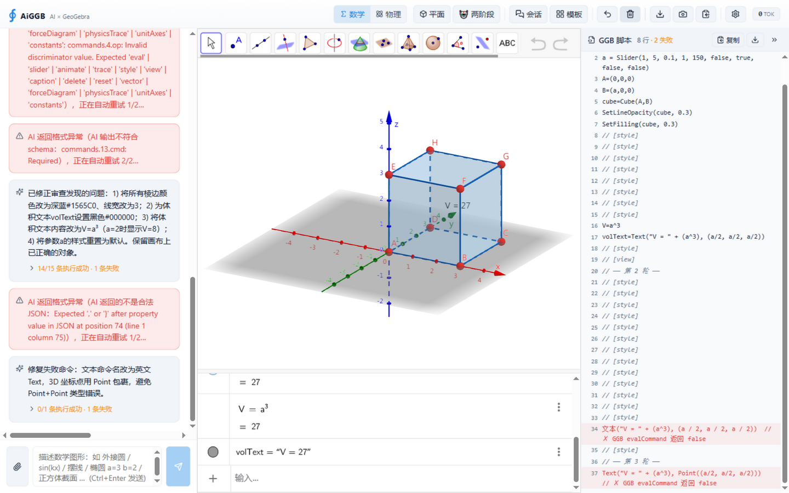
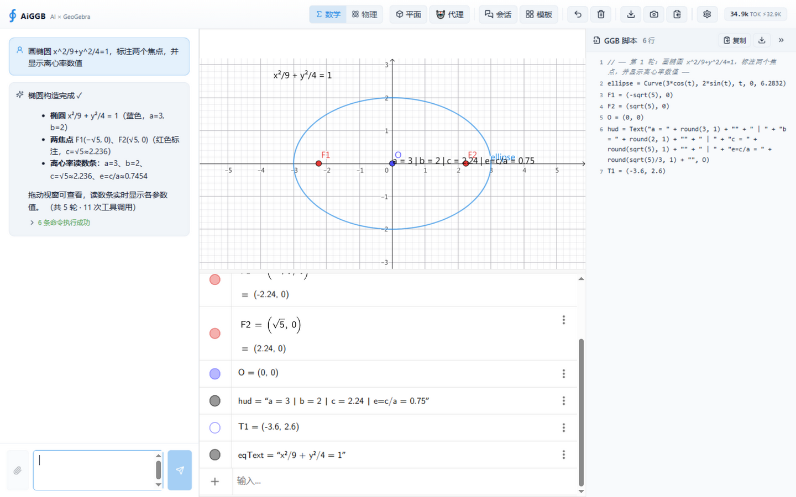

# AiGGB 整机测试报告·第二轮（2026-09-26）

> 上轮报告：[整机测试报告-2026-09-26.md](整机测试报告-2026-09-26.md)（首轮：5 个 P1/P3 修复 + 三项观察项修复）
> 本轮范围：离线基线复测 + 生产构建 + 浏览器 GUI 黑盒实测（真实 DeepSeek API 链路）+ **4 个新问题修复 + 1 个引擎级实测发现** + 回归复测
> 测试环境：Windows 10 / Vite dev server (5173) / ZCode IAB 浏览器 1440×900 / 自托管 GGB bundle 5.4.927
> 截图存证：`docs/整机测试-2026-09-26-第二轮/`（15 张）

---

## 一、测试结论总览

| # | 测试点 | 结果 | 证据 |
|---|---|---|---|
| 0a | 单元测试（离线） | ✅ **280/280**（修复后；基线 276 + 新增 4） | `npm run test:unit` |
| 0b | 离线回放 63 用例 14 类别 | ✅ 63/63（100%） | `npm run test:replay` |
| 0c | 生产构建（tsc + vite + PWA） | ✅ 通过 | `npm run build` |
| T1 | 首页加载 + GGB 画布注入 | ✅ | t1_home |
| T2 | 设置对话框（Provider/4-role 模型/用量图表）+ 真实连接测试 | ✅「连接成功 ✅ / 视觉模型 ✅」 | t2_* |
| T3 | Agent 模式长任务（椭圆场景） | ⚠→✅ 暴露问题 2/3（30 轮空转暂停）→ **修复后 R2 复测 5 轮 11 次调用零失败** | t3_*、r2_* |
| T3b | 两阶段流程·3D（Phase1 规格 → 确认 → Phase2 编译 → 自检 → 审查 → 修复） | ✅ 全链路走通（立方体 + 体积文本 + 滑块，防御层多次实况触发） | t3b_* |
| T4 | 模板库一键绘图（正弦函数族） | ✅ 规格气泡 ~6s，10 条命令全部成功 | t4_* |
| T5 | 2D↔3D UI 切换（`__aiggbConfirm` 注入，上轮受限路径本轮补测） | ✅ web3d 重建 + 3D 坐标系渲染正常 | t5_3d_switch |
| T8 | 清空画布与聊天（注入钩子路径） | ✅ 立即生效，消息/脚本面板归零 | t8_after_clear |
| T9 | 手动改动落盘 + 刷新恢复 | ⚠→✅ 暴露问题 1（3D 会话刷新模式不恢复）→ **修复后 R1 复测通过** | t9_* |
| R1 | **修复①回归**：3D 会话落盘 → 刷新 | ✅ 模式恢复 3D、Q3d=(2,1,3) 快照恢复、状态一致 | （本报告 §三） |
| R2 | **修复②③回归**：同款椭圆场景 Agent 轮 | ✅ 5 轮 11 次调用零失败，椭圆/焦点/离心率全对 | r2_ellipse_retest_pass |

## 二、发现并修复的问题

### 问题 1（P1）：3D 会话刷新后画布模式不恢复 → 状态不一致 + 二次切换丢画布

**现象**：3D 会话（正方体轮）按 F5 刷新后——聊天消息恢复正常恢复，但顶栏按钮显示「平面」（store `ggbAppName` 回落 classic 默认值），画布视觉上却是 3D 内容（快照经 `setBase64` 把 ggb 文件里的 3D 透视灌进了 classic applet）。此时用户再点模式切换按钮，会触发「切到 3D」二次重建——**画布被清空（数据丢失）**。

**根因**（代码定位）：
1. `initSessionFromStorage`（useAppStore.ts）恢复 messages/domain/agentMode/**但不恢复 `ggbAppName`**——`switchToSession` 有模式回填，启动初始化路径遗漏；
2. 快照消费无模式门控：classic applet 的 `appletOnLoad` 抢先消费 3D 快照（setBase64 后引擎按文件透视渲染，表面"看起来恢复了"），store 与画布真实模式从此不一致。

**修复**：
- `initSessionFromStorage` 回填 `ggbAppName`（会话保存的模式）；
- store 新增 `pendingCanvasSnapshotMode`，快照消费三方（GGBCanvas `appletOnLoad` / store 即时恢复路径 / `switchToSession`）全部按模式门控——applet 注入模式 ≠ 快照目标模式时禁止消费，等正确模式的 applet 重建后消费。

**回归（R1）**：3D 模式创建 `Q3d=(2,1,3)` → pagehide 落盘 → 刷新 → **顶栏「3D」+ Q3d 恢复 + is3D 一致** ✅

### 问题 2（P2）：赋值形态双等号直透引擎失败（椭圆场景首发命令根因）

**现象**（T3 椭圆轮）：AI 首发命令 `ell = x^2/9 + y^2/4 = 1` 引擎报「创建函数/表达式 失败」——预检九项检查全部放行。

**修复**：`commandValidate.ts` 新增第 ⑩ 项 `double-equals`：赋值等号右侧顶层再出现裸 `=` 即拦截，提示改用冒号命名（`ell: x^2/9+y^2/4=1`）。字符串字面量内、括号内（`If(a=b,…)`）、比较符（`==`/`<=`/`>=`/`!=`）不误伤。

### 问题 3（P2）：Conic 7 系数通过预检 + 引擎返回 true 产出 emptyset → Agent 30 轮空转

**现象**（同轮）：AI 连续重试 `Conic(1/9, 0, 1/4, 0, 0, 0, -1)`（7 参数，系数顺序也错）——预检放行（KB 只有 5 点重载、ARG_COUNT_HINTS 无 Conic），引擎对 7 系数**返回 true 却产出 emptyset 空型对象**（代数区显示 `ell: 圆锥曲线 = ?`），模型反复查询重试，30 轮迭代耗尽暂停，用户拿到半成品画布。

**修复 + 实测新知（★ 引擎级发现）**：
- ggbKB 的 Conic 补 6 系数重载（`paramCount: [5,6]`）+ ARG_COUNT_HINTS 加 `Conic: [5,6]`——7 参数进引擎前拦截；
- ★ **实测推翻官方手册**：本 bundle (5.4.927) 的 6 系数顺序是 **`Conic(a, b, c, d, e, f) → a·x² + b·y² + c·<常数> + d·xy + e·x + f·y = 0`**（常数项第 3 位、xy 第 4 位），手册标注的 `(ax²,by²,cxy,dx,ey,f)` 顺序会画出平移的错误曲线（实测 `Conic(1/9,1/4,0,0,0,-1)` → 中心 (0,2)；`Conic(1/9,1/4,-1,0,0,0)` → x²/9+y²/4=1 中心原点 ✓，画布 evalCommand 存证）。KB 示例已按实测顺序修正。

**回归（R2）**：同款椭圆场景 Agent 轮——**5 轮 · 11 次工具调用 · 6/6 命令零失败**（上轮 30 轮暂停失败）：参数化椭圆 `Curve(3cos(t), 2sin(t))` + 焦点 F1/F2(±√5,0) + 离心率读数条 `e=c/a = 0.75` 全部正确。

### 问题 4（P2）：满足度评估链路最坏 2×180s 挂起，「AI 思考中」无反馈超 6 分钟

**现象**（T4 正弦函数族轮）：Phase 2 十条命令全部成功后，「AI 思考中…」持续转圈 ~6-9 分钟才自行收尾（评估空响应重试 1 次 × 每次 180s 兜底超时 = 最坏 6 分钟，失败后按「不阻断」静默跳过——功能正确但体验极差）。

**修复**：`AIConfig.timeoutMs`（aiClient）允许按调用收紧兜底超时；满足度评估与视觉审查单次调用收紧为 **90s**（轻模型小输出）。最坏 2×90s=3 分钟，且仍保留失败不阻断。

### 问题 5（P3）：incomplete 轮暂停文案同气泡重复两次

**现象**：Agent 轮次耗尽时，单个 assistant 气泡内出现两份暂停文案（agentLoop 的 finalText「已达到单轮最大迭代次数…」+ pipeline 摘要附加行「⏸ 已达单轮最大轮次…」，信息 100% 重叠）。

**修复**：pipeline 的 incomplete 分支不再附加重复行（finalText 已含全部三要素：已达上限/画布保留对象数/发后续指令可续作）。回归测试同步更新（断言不重复 + 保留轮次统计）。

## 三、测试基建改进

- `window.__aiggbApi`（GGBCanvas appletOnLoad 暴露）：deployggb 的 `window.ggbApplet` 在 applet 重建后指向陈旧实例（实测 getObjectNumber 恒 0），本轮多次误导诊断——E2E 一律改用新句柄。
- 坐标点击/Playwright 定位在顶栏均不可靠（按钮被 React 高频重渲染 + 布局随 token 计数位移）：本轮改用 **DOM `.click()` 派发**（确定性最高），供后续 E2E 参照。
- 原生 confirm：本轮实测 IAB `getJsDialog()` 已能探测到对话框但 `accept()` 未生效（清空未执行）——与上轮「探测不到」结论又不同，自动化环境行为不稳定，继续以 `__aiggbConfirm` 注入钩子为准。

## 四、关键截图

**T3 Agent 模式暴露问题现场**（30 轮暂停 + Conic emptyset + 审查正确识别 2 问题）：

**T3b 两阶段·3D 全链路**（正方体 + 体积文本 + schema 格式重试/修复回路实况）：

**T9 问题现场**（刷新后顶栏「平面」vs 画布 3D 内容不一致）：

**R2 修复后椭圆复测**（5 轮 11 次调用零失败：椭圆 + 焦点 + 离心率 0.75 读数条）：

其余截图见 `docs/整机测试-2026-09-26-第二轮/`（设置对话框、连接测试、规格气泡、模板库、3D 切换、清空结果等）。

## 五、基线更新

| 指标 | 上轮修复后 | 本轮 |
|---|---|---|
| 单元测试 | 276/276 | **280/280**（+4：双等号 ×2、Conic 参数、timeoutMs） |
| 离线回放 | 63/63 | 63/63 |
| 生产构建 | 通过 | 通过 |
| 3D 会话刷新恢复 | 模式回落 classic ✗ / 二次切换丢画布 ✗ | **模式恢复 ✓ / 快照一致恢复 ✓** |
| 椭圆场景 Agent 轮 | 30 轮暂停、emptyset、半成品 ✗ | **5 轮零失败、图形完整 ✓** |

## 六、遗留观察项

1. **评估通过时无任何审查气泡**：两阶段轮审查发现问题时显示「⚠ 审查发现 N 个问题」，通过时完全静默——设计如此，可考虑轻量「✓ 审查通过」提示（未改代码）。
2. **评估/修复阶段无过程反馈**：「AI 思考中」转圈期间用户不知道当前在评估还是修复（Agent 模式有 onThinking 实时步骤，两阶段没有）——可复用同一机制（未改代码）。
3. **修复轮审查意见过度字面**：3D 立方体轮审查要求把动态文本 `V = 8` 改成字面 `V=a³`（动态值明明更有用），修复轮为此多跑两轮且 Text 重建失败（最终保留动态文本，结果反而正确）——评估 prompt 可加「动态/live 数值优于字面」条款（未改代码）。
4. **`window.ggbApplet` 陈旧引用**：deployggb 层面问题，已用 `__aiggbApi` 规避；上游无解。
