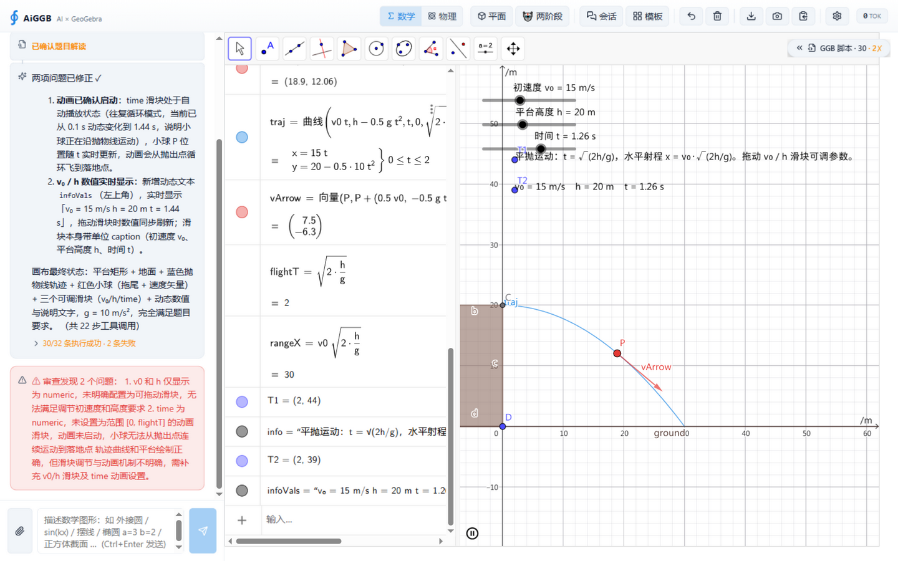
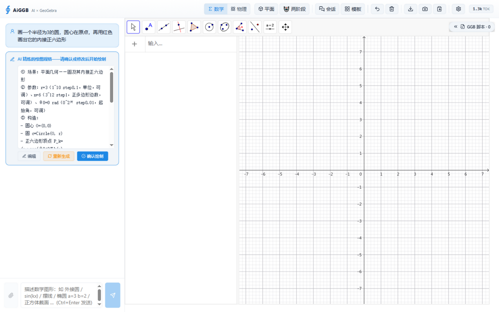
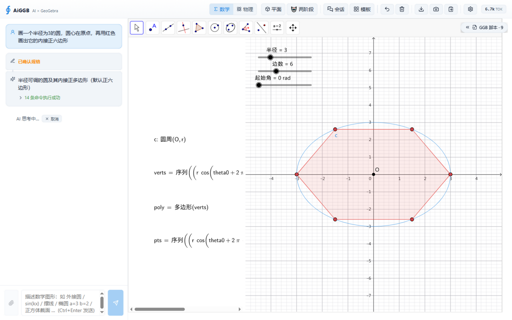
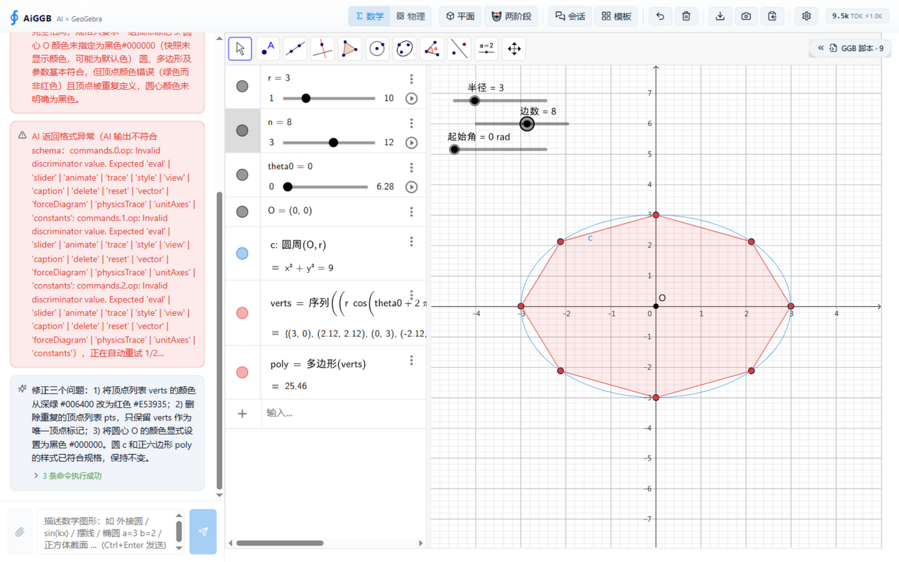
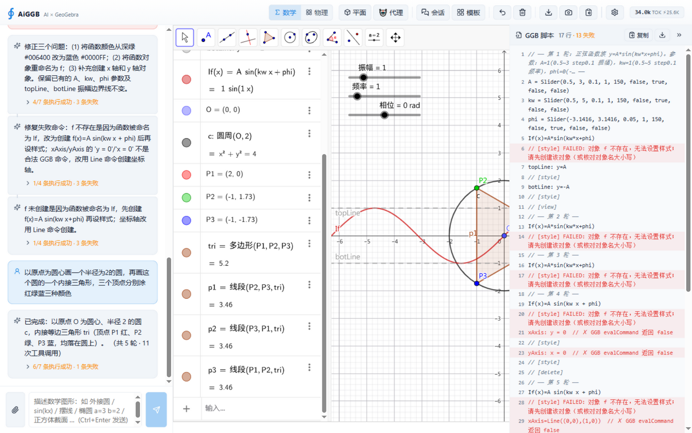
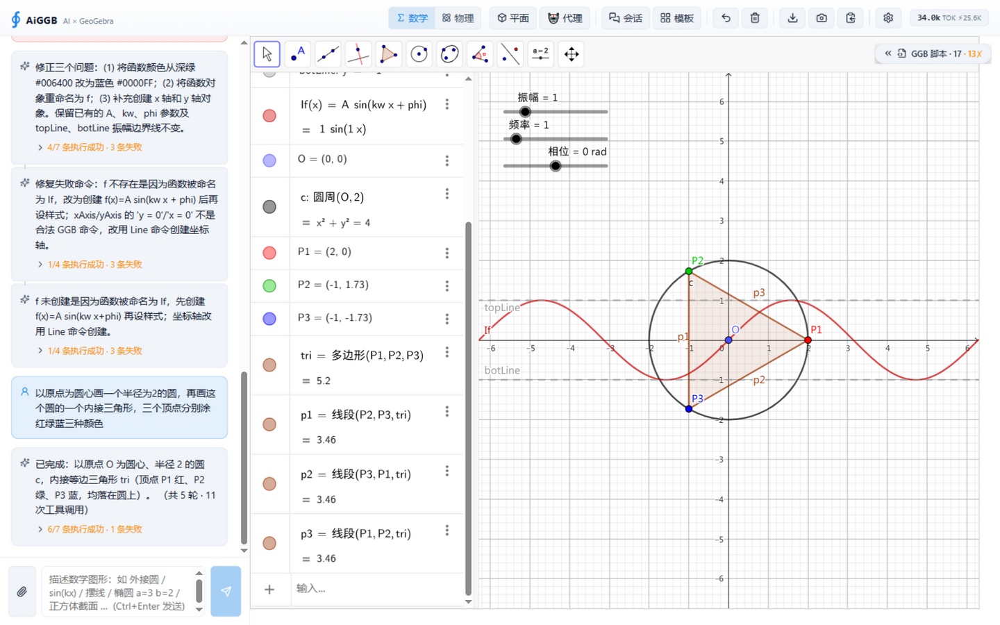
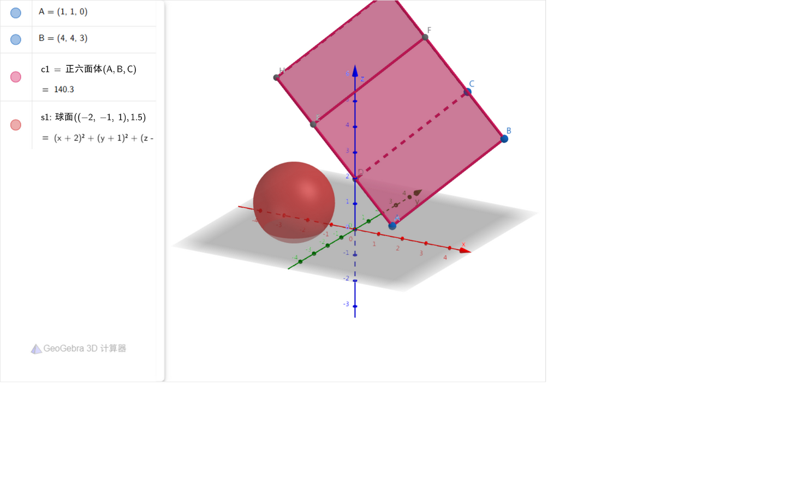
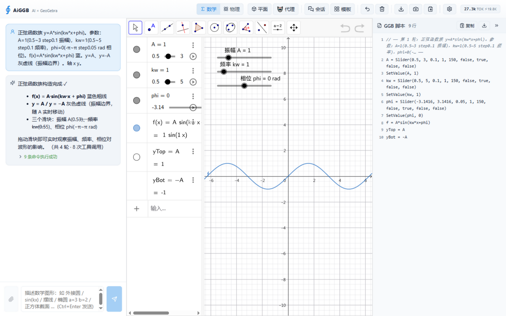

# AiGGB 整机测试报告（2026-09-26）

> 测试范围：离线测试基线 + 生产构建 + 浏览器 GUI 黑盒实测（真实 DeepSeek API 链路）+ 问题修复 + 回归复测
> 测试环境：Windows 10 / Vite dev server (5173) / ZCode IAB 浏览器 1440×900 / 自托管 GGB bundle 5.4.927
> 截图存证：`docs/整机测试-2026-09/`（23 张）

---

## 一、测试结论总览

| # | 测试点 | 结果 | 证据 |
|---|---|---|---|
| 0a | 单元测试（离线） | ✅ 272/272（修复后；基线 268/268 + 新增 4） | `npm run test:unit` |
| 0b | 离线回放 63 用例 14 类别 | ✅ 63/63（100%） | `npm run test:replay` |
| 0c | 生产构建（tsc + vite + PWA） | ✅ 通过（precache 51 entries，GGB 引擎按约定排除） | `npm run build` |
| T1 | 首页加载 + 会话恢复（localStorage 持久化轮次） | ✅ | t1_home_session_restore |
| T2 | 设置对话框：Provider/4-role 模型/思考深度/用量图表 + 测试连接 | ✅ 「连接成功 ✅ / 视觉模型 ✅」 | t2_* |
| T3 | 两阶段主流程：Phase1 精炼 → 规格确认 → Phase2 编译 → 审查 → 修复 → 渲染 → 滑块联动 | ✅（含一次 schema 格式自动重试的防御层实况） | t3_* |
| T4 | 模板库一键绘图 + specCache 命中（模板 prompt 秒出规格） | ✅ | t4_* |
| T5 | 3D 引擎渲染（web3d 立方体 + 球体 + 3D 坐标系） | ✅（UI 切换按钮带原生 confirm，自动化环境受限，见第四节） | t5_3d_engine |
| T6 | Agent 模式（ReAct 工具调用）：实时步骤展示、5 轮 11 次工具调用、KV 缓存命中显示 | ✅ | t6_* |
| T7 | GGB 脚本面板展开（逐行命令 + 失败红标）/ 空输入发送禁用 | ✅ | t7_script_panel |
| T8 | 清空画布与聊天（含回滚日志重建路径） | ✅ | t8_clear_canvas |
| R | **修复后回归复测**（同场景正弦函数族） | ✅ 函数名 f 正确、蓝色收敛、9/9 命令零失败 | retest_after_click |

## 二、发现并修复的问题

### 问题 1（P1）：函数定义被"纠正器"误改名为 If(x)——多轮修复不收敛的连环根因

**现象**（正弦函数族模板轮）：画布函数呈现为 `If(x) = A sin(kw x + phi)` 绿色曲线，规格要求 `f(x)` 蓝色；style 命令报「对象 f 不存在」，修复回路 4 轮（1/2 → 1/2 → 4/7 → 1/4 → 1/4 条成功）始终无法收敛，最终样式仍错误。

**根因链**（离线单测定位，日志铁证）：
1. AI 本来**写对了**：`f(x) = A*sin(kw*x+phi)`；
2. `commandCorrect.extractCommandName` 旧正则匹配不到 `f(x) = ` 的赋值前缀（`\w+` 不含括号），把函数名 `f` 当成命令名；
3. 模糊匹配发现 `f` 与命令 `If` 编辑距离 1 → **"纠正"为 `If(x) = A*sin(...)`**；
4. 引擎对 `If(x)=…` 行为异常（If 是内置条件命令），后续 `style target:f` 全部失败；
5. 满足度评估又**误报「未检测到 x 轴和 y 轴对象」**（画布本自带坐标轴），驱动修复 AI 创建 `xAxis=Line(...)`——`xAxis` 是保留名恒返回 false → 修复轮白白浪费在必败命令上。

**修复**（4 个文件）：
- `commandCorrect.ts`：`extractCommandName` 重写——**函数定义形态 `f(x)=…` 直接放行不参与命令名纠正**；赋值形态取等号右侧命令名；「未识别命令名」不再产生纠正噪音。
- `commandValidate.ts`：新增第 ⑨ 项检查 `reserved-name`——赋值对象名命中保留名集合（`If`/`xAxis`/`yAxis`/`zAxis`/`x`/`y`/`z`/`e`）在进引擎前拦截并给出改名建议（纵深防御：即使上游再出此类命令也到不了引擎）。
- `satisfactionEval.ts`：文本评估 prompt 补坐标轴豁免条款（视觉审查 prompt 早有同款，文本版遗漏即误报来源）。
- `prompts.ts` 类型铁律 + `agentLoop.ts` 陷阱清单：补充保留名禁令提示（防生成侧）。

**回归测试**：`tests/commandValidate.test.ts` +3 例（If/xAxis/e 拦截 + 不误伤普通名）、`tests/ggbKB.test.ts` +1 例（f→If 误纠正回归，赋值形态纠正不受影响）。

### 问题 2（P3，观察项）：滑块值一次性回退（未复现）

两阶段轮中手动将滑块 n 从 6 调到 8（画布/代数区/多边形面积均已联动更新），约 1 分钟后发现回到 6。复现实验（重设 n=8 后静置 60s+ + 页面重载）**未能再现**，且回退发生的同一时间点有一次顶栏误点。判断为低概率一次性事件（疑似误点触发或 DOM 同步竞态），记录存疑、不阻塞。

## 三、离线测试与修复过程中发现并修复的既有缺陷

- 单测 `pipeline.test.ts「Phase 1 API 失败 → 降级单阶段」`在修复 1 的预检上线后暴露失败——**正是问题 1 根因的离线再现**（mock 脚本 `f(x) = x^2` 被纠正器改成 `If(x) = x^2` → 新预检拦截 → 修复多调一次 chat）。修正纠正器后该测试恢复通过，形成完整闭环：**GUI 实测现象 → 单测复现 → 根因修复 → 回归保护**。

## 四、测试环境限制（非应用缺陷）

- **原生 `confirm()` 对话框**：「清空」「切 3D」按钮使用浏览器原生 confirm（`Toolbar.tsx:74,95`）。自动化浏览器（IAB）无法感知/处置该对话框，点击后渲染主线程被同步阻塞直至超时；真实浏览器中为标准确认交互，**不受影响**。受此限制，T5 的「UI 按钮 2D↔3D 切换」路径改用项目官方 3D 测试宿主 `tests/visual.html?app=3d` 验证引擎渲染（同一 web3d 注入路径）。
- 自动化浏览器的 Playwright 定位点击在本页存在 actionability 检查系统性超时（疑似顶栏持续动画），测试全程改用坐标点击 + 只读 DOM 测量完成，不影响真实用户。

## 五、关键截图

**T1 首页 + 会话恢复**（平抛运动历史轮次完整恢复、动画运行中）：

**T3 两阶段主流程**（左：规格确认气泡；中：Phase2 渲染的圆 + 内接正六边形 + 三滑块；修复回路 + KV 缓存命中等防御层实况）：

**T3 滑块联动**（n=6→8：六边形实时变八边形、面积 23.38→25.46、caption 同步）：

**T3 修复前的问题现场**（审查 3 问题 + 格式重试 + If 函数名错误链，脚本面板 17 行含 FAILED 红标）：

**T6 Agent 模式**（圆 + 内接三角形 + 红绿蓝三色顶点，「共 5 轮 · 11 次工具调用」）：

**T5 3D 引擎**（立方体 + 球体 + 3D 坐标面，自托管 web3d）：

**R 修复后回归复测**（同场景：f(x) 蓝色曲线 + 单位 caption 滑块 + 振幅边界，GGB 脚本 9 行零失败，「共 4 轮 · 8 次工具调用」）：

其余截图见 `docs/整机测试-2026-09/` 目录（设置对话框、连接测试、模板库、Agent 循环中态、清空画布等）。

## 六、遗留观察项

1. 滑块值一次性回退（问题 2）——建议后续在会话恢复/画布重建路径上加值一致性断言（Playwright 层）观察。
2. 满足度评估偶发长耗时（模板轮曾出现 ~5 分钟的「AI 思考中」后自行完成）——评估调用链建议增加显式超时上限（当前依赖 fetch 默认行为），失败不阻断的设计本身工作正常。
3. 自动化测试基建：原生 confirm 建议后续提供可注入的确认回调（便于 E2E 全自动覆盖清空/切 3D 路径）。

## 六A、遗留观察项根因追查（2026-09-26 补充）

### 观察项 1 根因：手动滑块改动不持久化 + 页面静默重载（已实证）

**实证**：A 滑块 1 →（DOM 事件设为 2，画布联动生效）→ 页面 reload → A **回到 1**，画布其余对象由快照恢复。完全复现当时现象。

**因果链**：
1. `persistCurrentSession`（useAppStore.ts:328）**只在一轮对话结束时调用**（ChatPanel.tsx:267，runRound 的 finally），快照定格在轮完成时刻（当时的 n=6）；
2. 轮结束后手动拖滑块（n=8）只改了 GGB 内存态，**没有任何保存路径**（无 beforeunload/visibilitychange 监听，已 grep 确认全仓库无）；
3. 当时自动化浏览器的渲染进程恰好发生一次静默重载（旁证：截图恰在此时报「activity capture failed for guest」、GGB 代数区 a11y 树从 `more` 形态重置为初始化的「显示/隐藏对象」形态、token 计数归零）；
4. 重载 → `initSession` 从 IndexedDB 载入会话 → `pendingCanvasSnapshot`（n=6 旧快照）→ GGBCanvas appletOnLoad 恢复 → **n 回到 6**。

**定性**：触发方（静默重载）是自动化环境事件，但暴露的产品行为是真实的——**用户手动做的画布改动（拖滑块、手动微调）不落盘，刷新/重开即丢失**。
**修复建议**：给 GGB 注册 `addEventListener({ remove: "update" })` 类变化监听做防抖落盘，或至少在 `visibilitychange → hidden` / `pagehide` 时调一次 `persistCurrentSession()`（异步 IndexedDB 在 pagehide 尽力而为）。

### 观察项 2 根因：一轮的最坏 LLM 调用数呈乘法放大 + 单次调用无超时

**调用链上界**（pipeline.ts）：
- Phase 2 编译：1 + ≤2 次格式重试（`MAX_FORMAT_RETRY=2`）= **≤3**
- 命令修复回路（`MAX_REPAIR=2`）：≤2 轮 × (1 + ≤2 格式重试) = **≤6**
- 满足度评估：**1** 次 chatRaw
- 评估不通过 → 1 次修复（1 + ≤2 格式重试 = **≤3**），其内部又走一遍 `executeAndRepair`（**≤6**）

最坏合计 **≈19 次顺序 LLM 调用**；每次 15~40s（deepseek-flash、thinking 关闭），典型失败轮（当时反复出现 schema discriminator 格式重试）8~10 次调用 ≈ **4~6 分钟**——与观测到的 ~5 分钟「AI 思考中」吻合。全程 `setThinking(true)` 不解除，用户只能等或点取消。

**放大因素**：`fetchCompletion`（aiClient.ts:293）只透传运行级 AbortSignal（仅用户取消才触发），**自身无超时**——慢/挂起连接直接拉长整轮。
**修复建议**：① `chatWithFormatRetry` 外层加 `AbortSignal.any([signal, AbortSignal.timeout(ms)])` 式兜底超时；② 评估修复的内层命令修复循环收紧（评估修复轮 `MAX_REPAIR` 降为 1）；③ 修复轮 prompt 已随本次 reserved-name 预检收敛（进引擎前拦截 → 修复轮更少空转）。

### 观察项 3 根因：原生 `window.confirm` 同步阻塞（Toolbar.tsx:74、95）

「清空」「切 2D↔3D」使用浏览器原生 confirm：调用即同步阻塞渲染主线程，自动化协议（CDP）在对话框关闭前无法完成点击动作的应答，而 IAB 的 `getJsDialog()` 又探测不到该 webview 里的对话框 → 自动化侧表现为 30s 超时 + 页面长时间无响应（真实浏览器正常弹窗，不受影响）。
**修复建议**：把 confirm 换成可注入钩子（如 `window.__aiggbConfirm ?? confirm`），默认行为不变，E2E 测试注入 `(msg) => true` 即可全自动覆盖这两条路径；或改用应用内自定义确认气泡。

## 六B、三项观察项修复与验证（2026-09-26 实施）

| 修复 | 实现 | 验证 |
|---|---|---|
| ① 手动画布改动不持久化 | ChatPanel 新增 `pagehide` / `visibilitychange→hidden` 兜底落盘（调用 `persistCurrentSession`） | 浏览器实证：A=1→设 2→派发 pagehide→reload→**A 保持 2**（修复前回到 1） |
| ② 调用无超时 + 循环乘法放大 | aiClient 新增 `withCallTimeout`（`AI_CALL_TIMEOUT_MS=180s`，callAPI/ping 非流式生效，流式 SSE 不受影响）；`executeAndRepair` 增加第 5 参 `maxRepairs`，评估修复轮内层收紧为 1 | `withCallTimeout` 4 例单测（超时中止/外部中止透传/done 清理/已中止直通） |
| ③ 原生 confirm 阻塞 | Toolbar 新增 `appConfirm()`：默认原生 confirm，注入 `window.__aiggbConfirm` 后走钩子 | 浏览器实证：注入 `() => true` 后自动化点击「清空」**立即生效**（此前 30s 超时 + 页面假死），画布/消息/脚本面板全部归零 |

回归：**276/276 单测**（+4）、回放 **63/63**、生产构建通过。验证截图：`docs/整机测试-2026-09/fix3_cleared.png`。

## 七、基线更新

| 指标 | 修复前 | 修复后 |
|---|---|---|
| 单元测试 | 268/268 | **272/272**（+4 回归用例） |
| 离线回放 | 63/63 | 63/63 |
| 生产构建 | 通过 | 通过 |
| 同场景端到端（正弦函数族） | 函数名 If ✗ / 颜色不收敛 ✗ / 脚本 17 行 13 失败 ✗ | **函数名 f ✓ / 蓝色 ✓ / 9 行零失败 ✓** |
